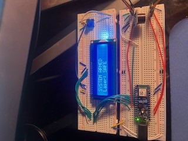
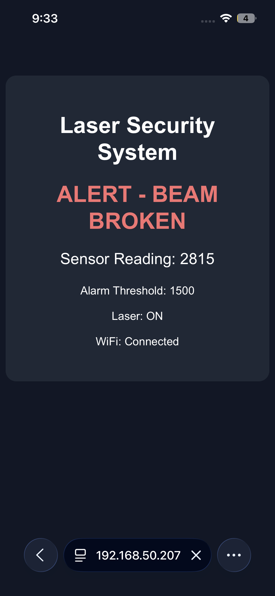

# Version 3 Laser Home Security System
## Upgrade description
Laser Security system upgraded with new ESP32 micro-controller. This includes Wifi connectivity, and local web-page displaying system status. 
## Details
This upgrade brought a complete rewire of the entire system, which now has much neater wiring, and orginization. The ESP32 is the replacement for the Arduino Uno Q, which brings some advantages and disadvantages. Firstly the ESP32 allows for Wifi and Bluetooth connectivity, which allows for the local wifi webpage displaying system status, photoresistor reading, and if laser is on. The main disadvantage ESP32 brought was its voltage limitation, operating on 3.3V, while some of the modules require 5V. Because of this the wiring was alot more complex, having to wire some modules through the VBUS (5V alternative) instead of all through the same 3.3V rail. 
## New Modules Added
-ESP32 microcontroller
-Local Web-Page displaying system status

.png)

