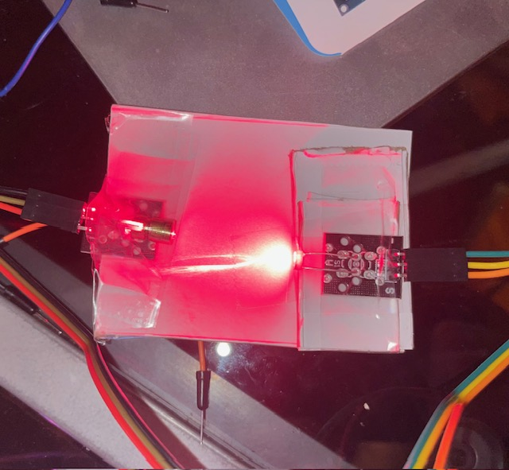
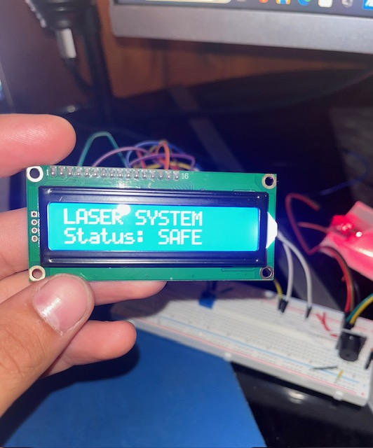

# Version 2 of laser-Tripwire-Home-Security system
## Upgrade description
Home security system upgraded with LCD screen. Screen will displays alert if beam is broken, and will show system is safe when beam is not broken. 
## Details
along with LCD display showing safety system status, there is potentiometer to adjust brightness of display. Laser model with photoresistor upgraded aswell. The laser module and photoresistor have been attached to a mobile flat plane to ensure they are always directly in line of eachother for tests. 
## New modules added 
-LCD 1602 module (with 16 pins)
-Potentiometer
-flat piece of plastic with tape (for laser/photoresistor upgrade)

